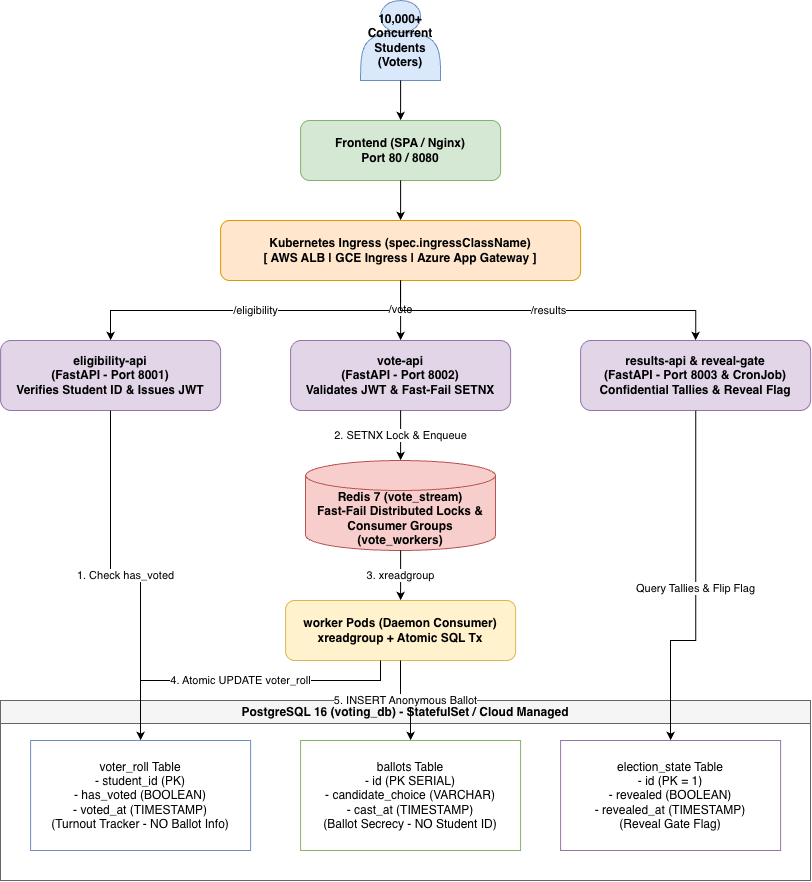

# Kubernetes Multi-Cloud Student Election Voting Platform

A high-concurrency, multi-cloud student council election voting platform architected to support 10,000+ concurrent voters. Built to demonstrate containerized microservices deployment across three major cloud providers (Amazon EKS, Google Cloud GKE, and Microsoft Azure AKS) using a single codebase, Kustomize overlays, GitOps delivery via ArgoCD, and infrastructure as code via Terraform.

---

## 1. Architecture Overview

The system is partitioned into decoupled microservices communicating asynchronously via Redis Streams and persisting data into PostgreSQL.



### Core Design Guarantees

1. **Strict Vote-Once Enforcement**:
   - **Fast-Fail Layer**: `vote-api` acquires a distributed lock in Redis via `SETNX` with a key TTL of 86400 seconds. Duplicate vote attempts are rejected immediately at the API edge with HTTP 409 Conflict.
   - **Database Consistency Layer**: The `worker` executes an atomic SQL transaction:
     ```sql
     UPDATE voter_roll SET has_voted = TRUE
     WHERE student_id = %s AND has_voted = FALSE;
     ```
     Only if the update affects exactly 1 row does the worker proceed to insert the ballot into the `ballots` table and acknowledge the message in Redis (`XACK`).

2. **Architectural Ballot Secrecy**:
   - The `voter_roll` table tracks identity and turnout state only (`student_id`, `has_voted`).
   - The `ballots` table stores only candidate selections (`id`, `candidate_choice`).
   - There are zero foreign keys, IDs, references — or timestamps — connecting `ballots` back to `voter_roll`. (Both tables once carried `NOW()` written in the same transaction, which was a trivial join; neither does now, and the worker never logs an ID next to a choice.)
   - `vote-api` accepts only candidates from the `CANDIDATES` allowlist, so nothing user-controlled reaches the tally or the results page.

3. **Results Confidentiality**:
   - `results-api` evaluates the `election_state.revealed` boolean flag before serving tally computations.
   - While polls remain open, queries to `/results` return `{"revealed": false}`.
   - The `reveal-gate` CronJob flips the flag when polls close. It ships **suspended** (the flag is one-way; a daily schedule on a cluster provisioned before election day would reveal results early) — see `k8s/base/cronjob-reveal.yaml` for the one-liner to arm it. There is no HTTP route for it.

---

## 2. Tech Stack

| Layer | Technology | Details |
|---|---|---|
| Frontend | React / Vanilla JS + Nginx | Static single page application served via lightweight Nginx container |
| APIs | Python 3.11 + FastAPI + Pydantic v2 | High-throughput asynchronous REST APIs |
| Queue / Cache | Redis 7 | Redis Streams with Consumer Groups (`xreadgroup`) and atomic locks (`SETNX`) |
| Database | PostgreSQL 16 | ACID-compliant relational storage with separate identity and ballot tables |
| Containerization | Docker | Slim images, every container runs as a non-root user |
| Kubernetes | Kustomize (clusters provisioned at 1.35; manifests use only long-GA APIs) | Base manifests with overlays for EKS, GKE, and AKS |
| Infrastructure as Code | Terraform (HashiCorp) | Modular IaC for AWS, GCP, and Azure environments |
| GitOps | ArgoCD | Declarative application definitions targeting cloud overlays |
| CI/CD | CircleCI | Integration test against the compose stack, then build & push images to GHCR |
| Load Testing | k6 | Distributed JS-scripted load testing simulating election closing traffic spikes |

---

## 3. Repository Structure

```
.
|-- .circleci/
|   `-- config.yml                     # CircleCI CI/CD pipeline definition
|-- argocd/
|   `-- applications/
|       |-- voting-apps.yaml           # ArgoCD Application manifests for EKS, GKE, and AKS
|       `-- platform.yaml              # Cluster add-ons the overlays need (External Secrets, ALB controller)
|-- k8s/
|   |-- base/                          # Cloud-agnostic Kustomize base manifests
|   |   |-- deployments/               # Deployments for all microservices
|   |   |-- statefulsets/              # PostgreSQL StatefulSet and PVC definition
|   |   |-- configmap.yaml             # Shared application configurations (incl. CANDIDATES allowlist)
|   |   |-- init.sql                   # Database schema + 10,000 synthetic voters (also mounted by compose)
|   |   |-- ingress.yaml               # Routing configuration across API paths
|   |   |-- hpa.yaml                   # HorizontalPodAutoscalers for vote-api and worker
|   |   |-- network-policies.yaml      # Zero-trust namespace network isolation policies
|   |   |-- rbac.yaml                  # Least-privilege ServiceAccounts
|   |   |-- cronjob-reveal.yaml        # Scheduled results reveal CronJob
|   |   `-- kustomization.yaml         # Base Kustomize bundle
|   `-- overlays/                      # Cloud provider overlays
|       |-- eks/                       # AWS EKS overlay (ALB Ingress, gp3, IRSA, ExternalSecret <- Secrets Manager)
|       |-- gke/                       # GCP GKE overlay (GCE Ingress, premium-rwo, WI, ExternalSecret <- Secret Manager)
|       `-- aks/                       # Azure AKS overlay (AGIC Ingress, managed-csi, Entra WI, Key Vault CSI)
|-- load-test/
|   `-- spike.js                       # k6 load testing script (50 to 2,000 RPS)
|-- scripts/
|   `-- generate_diagram.py            # Regenerates docs/architecture.drawio
|-- services/
|   |-- eligibility-api/               # Verification & JWT token issuance service
|   |-- vote-api/                      # Fast-fail duplicate checking & enqueue service
|   |-- worker/                        # Stream consumer & transactional database worker
|   |-- results-api/                   # Aggregated tallies & turnout reporting service
|   |-- reveal-gate/                   # Polls-close reveal trigger script
|   `-- frontend/                      # Web UI for voter interaction
|-- terraform/
|   |-- environments/                  # Root environments (eks, gke, aks)
|   `-- modules/                       # Reusable infrastructure modules (eks, gke, aks)
|-- docker-compose.yml                 # Local development stack (+ `reveal-gate` under the `tools` profile)
|-- Makefile                           # Developer automation targets
`-- test_e2e.py                        # Integration test against the compose stack (real services, no mocks)
```

---

## 4. Microservices Breakdown

### 1. `eligibility-api` (Port 8001)
- **Path**: `POST /eligibility/verify`
- **Payload**: `{"student_id": "STU00042"}`
- **Behavior**: Validates student ID against `voter_roll`. If valid and `has_voted == FALSE`, generates and returns a signed 15-minute JWT (`HS256`).

### 2. `vote-api` (Port 8002)
- **Path**: `POST /vote`
- **Payload**: `{"token": "<jwt>", "candidate_id": "Slate 1"}`
- **Behavior**: Verifies the JWT signature, rejects any `candidate_id` not in the `CANDIDATES` allowlist (422), acquires an atomic lock in Redis via `SETNX` on key `voted_lock:<student_id>`, then enqueues the vote to Redis Stream `vote_stream`.

### 3. `worker`
- **Behavior**: Runs as a daemon in consumer group `vote_workers`. Replays its own pending entries on start, reclaims messages abandoned by dead consumers (`XAUTOCLAIM`), reads new batches with `XREADGROUP`, executes the atomic single-vote update on PostgreSQL, inserts the choice into `ballots`, and commits before `XACK`. Any error rolls the transaction back and leaves the message to be retried.

### 4. `results-api` (Port 8003)
- **Path**: `GET /results`
- **Behavior**: Checks `election_state.revealed`. If false, returns hidden status. If true, computes candidate tallies, total turnout, and turnout percentages.

### 5. `frontend` (Port 8080)
- **Behavior**: Static page on unprivileged nginx with tabs for eligibility check, ballot submission, and results.

> **Authentication is mocked by design.** Knowing a (sequential, synthetic) student ID is the only credential, so anyone can vote as anyone; `POST /eligibility/verify` also tells an unauthenticated caller whether a given ID has voted. That is the scope set in `CLAUDE.md` — the project practices the vote-once and secrecy mechanics, not identity.

---

## 5. Multi-Cloud Kubernetes Adaptations

Kustomize overlays isolate cloud-specific infrastructure requirements while keeping container code 100% portable:

| Configuration Area | Amazon EKS Overlay (`/k8s/overlays/eks`) | Google Cloud GKE Overlay (`/k8s/overlays/gke`) | Microsoft Azure AKS Overlay (`/k8s/overlays/aks`) |
|---|---|---|---|
| Ingress Class | `spec.ingressClassName: alb` | `spec.ingressClassName: gce` | `spec.ingressClassName: azure-application-gateway` |
| Storage Class | `gp3` (EBS CSI Driver) | `premium-rwo` (GCE Persistent Disk) | `managed-csi` (Azure Disk CSI) |
| Workload Identity | IAM Roles for Service Accounts (`eks.amazonaws.com/role-arn`) | GKE Workload Identity (`iam.gke.io/gcp-service-account`) | Microsoft Entra Workload ID (`azure.workload.identity/client-id` + labels) |
| Secrets | `ExternalSecret` from AWS Secrets Manager (`voting/app`) | `ExternalSecret` from GCP Secret Manager (`voting-app`) | `SecretProviderClass` from Key Vault via the CSI addon |
| NetworkPolicy enforcement | VPC CNI addon with `enableNetworkPolicy: true` | Dataplane V2 (`datapath_provider = ADVANCED_DATAPATH`) | `network_policy = "azure"` |
| Ingress controller install | ALB controller via `argocd/applications/platform.yaml` | Built in | AGIC managed addon (Terraform) |
| Container Registry | `ghcr.io/cloudenochcsis/student-voting/*` (public; CI pushes here) | same | same |

None of the three clouds enforces `NetworkPolicy` out of the box — each needs the flag above, or every policy in `k8s/base/network-policies.yaml` is silently accepted and ignored. The Terraform modules set them.

`voting-secrets` is never committed. Each overlay materialises it from the cloud's secret store; the seed command is in the overlay's `secrets.yaml`. On kind/local: `kubectl -n voting create secret generic voting-secrets --from-literal=DATABASE_URL=... --from-literal=POSTGRES_PASSWORD=... --from-literal=JWT_SECRET=...`.

---

## 6. Infrastructure as Code (Terraform)

Terraform modules provision the full networking and Kubernetes control plane on each cloud provider.

### Provisioning Amazon EKS
```bash
cd terraform/environments/eks
terraform init
terraform plan
terraform apply
```

### Provisioning Google Cloud GKE
```bash
cd terraform/environments/gke
terraform init
terraform plan
terraform apply
```

### Provisioning Microsoft Azure AKS
```bash
cd terraform/environments/aks
terraform init
terraform plan
terraform apply
```

---

## 7. Local Development & Testing

Start the application services, PostgreSQL, and Redis:
```bash
make dev        # docker compose up -d --build
make reveal     # flip the reveal flag (same script as the CronJob)
make down       # stop and drop the database volume (re-runs init.sql next time)
```
Access the application frontend at `http://localhost:8080`.

---

## 8. Automated Testing & Load Testing

### Run the Integration Test
`test_e2e.py` runs against the live compose stack — no mocks — and proves the guarantees that matter: 50 concurrent submissions with one token yield exactly one ballot; 20 raw stream entries for one student (bypassing the Redis lock) still yield one ballot with nothing left unacked; the ballot schema has no identity or timestamp columns; unknown candidates are rejected; results stay hidden until the flag flips.
```bash
make dev && make test
# or: python3 test_e2e.py   (needs psycopg2-binary and redis installed locally)
```

### Run k6 Load Test (Simulating Peak Election Spike)
Simulates the last-hour surge with an arrival-rate executor ramping from 50 to 2,000 requests/second (409s count as expected once the 10k pool drains):
```bash
make k6-load
# or: k6 run load-test/spike.js
```

---

## 9. GitOps Delivery with ArgoCD

ArgoCD manages multi-cluster delivery by tracking the repository and synchronizing overlay changes automatically:

```yaml
apiVersion: argoproj.io/v1alpha1
kind: Application
metadata:
  name: student-voting-eks
  namespace: argocd
spec:
  project: default
  source:
    repoURL: 'https://github.com/cloudenochcsis/k8s-voting-platform.git'
    targetRevision: HEAD
    path: k8s/overlays/eks
  destination:
    server: 'https://kubernetes.default.svc'
    namespace: voting
  syncPolicy:
    automated:
      prune: true
      selfHeal: true
```

---

## 10. CI/CD with CircleCI

The automated CircleCI pipeline defined in `.circleci/config.yml` triggers on merge to `main`:
1. **Test Job**: brings the compose stack up on a machine executor and runs `test_e2e.py` against it.
2. **Build & Push Job** (main only): builds all 6 images and pushes them to `ghcr.io/cloudenochcsis/student-voting/<service>:${CIRCLE_SHA1}` (needs `GHCR_USER` / `GHCR_TOKEN` project env vars). Bumping the tag in `k8s/overlays/*/kustomization.yaml` is a follow-up (ArgoCD Image Updater, or a `kustomize edit set image` commit with a write deploy key).
